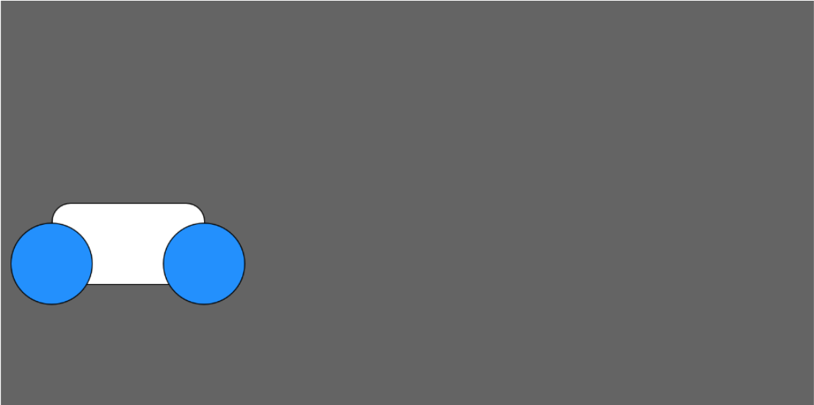

# Build and Animate a Tron Bike!

## Instructions
**1.** Make the tron bike on a grey canvas with dimensions `windowWidth` x `windowHeight`. The wheels should be ellipses with dimensions 80x80, and the body of the bike should be a rectangle with dimensions 150x80. You will need to figure out how to round the corners using an additional argument. 

**2.** Make the tron bike start in the bottom left and move across the screen from left to right.

**3.** Make the tron bike move back and forth across the screen (bouncing off the edges of the canvas)

**4.** Create a `speed` global variable, and use it to make the car move faster or slower

## Bonus Options

* Use the `keyPressed()` P5 function to allow the user to increase or decrease the speed of the bike using the up and down arrow keys. You can read more about this function in the <a href="https://p5js.org/reference/#/p5/keyPressed">P5 documentation</a>

* Use the `text` P5 command to write the position of the tron bike at the top of the screen. You can read more about this command in the <a href="https://p5js.org/reference/">Typography Section of the P5 documentation</a>

* Create a race!

    **1.** Set the speed to a random number between 1 and 10 upon initialization.

    **2.** Create two tron bikes, and make them race across the screen (with each bike's speed initializing to a random number so the race outcome isn't predictable!)

    **3.** Use the `text` P5 command to declare the winner of the race when one of the cars wins!
